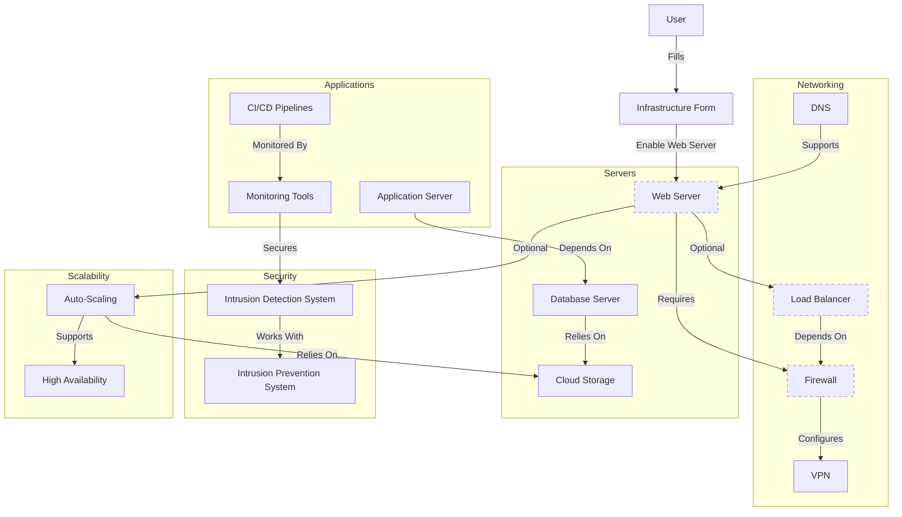

# Infra App

```mermaid

graph TD
    subgraph Networking
        VPN[VPN]
        DNS[DNS]
        Firewall[Firewall]
        LB[Load Balancer]
    end

    subgraph Servers
        WebServer[Web Server]
        DB[Database Server]
        Storage[Cloud Storage]
    end

    subgraph Security
        IDS[Intrusion Detection System]
        IPS[Intrusion Prevention System]
    end

    subgraph Applications
        CI[CI/CD Pipelines]
        AppServer[Application Server]
        Monitoring[Monitoring Tools]
    end

    subgraph Scalability
        AutoScaling[Auto-Scaling]
        HA[High Availability]
    end

    User[User]
    Form[Infrastructure Form]

    %% Connections
    WebServer -->|Requires| Firewall
    WebServer -->|Optional| LB
    WebServer -->|Optional| AutoScaling
    LB -->|Depends On| Firewall
    Firewall -->|Configures| VPN
    AutoScaling -->|Relies On| Storage
    DB -->|Relies On| Storage
    AppServer -->|Depends On| DB
    CI -->|Monitored By| Monitoring
    Monitoring -->|Secures| IDS
    IDS -->|Works With| IPS
    AutoScaling -->|Supports| HA
    DNS -->|Supports| WebServer

    %% User Interaction
    User -->|Fills| Form
    Form -->|Enable Web Server| WebServer

    %% Information theory inference
    classDef inferred stroke-dasharray: 5, 5;
    WebServer:::inferred
    LB:::inferred
    Firewall:::inferred
```
