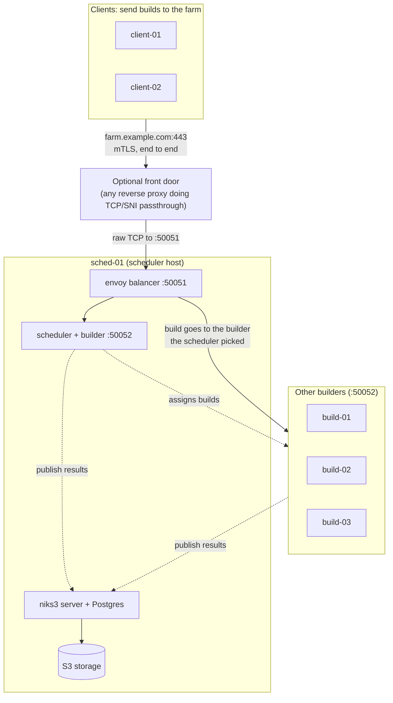

# Nix Build Farm (`fmf.services.nix-grpc-store`)

A generic guide to the build farm module in this flake: what it does, how to wire it
into a host configuration, and what has to exist in Vault before it will run.

It wraps [nix-grpc-store](https://github.com/Mic92/nix-grpc-store); that project's
[farm guide](https://github.com/Mic92/nix-grpc-store/blob/main/docs/farm.md) is the
reference for the underlying daemon. All names, addresses and domains below are
**examples**: substitute your own.

> **Status:** the module evaluates cleanly, but it has been validated by
> evaluation only. Treat the first real deployment as the test. See
> [Known gaps](#known-gaps).

## Table of contents

- [The idea in one minute](#the-idea-in-one-minute)
- [Example layout](#example-layout)
- [How a build travels](#how-a-build-travels)
- [How the module is wired](#how-the-module-is-wired)
- [Security model](#security-model)
- [Vault setup (do this first)](#vault-setup-do-this-first)
- [Deploying](#deploying)
- [Checking that it works](#checking-that-it-works)
- [Everyday changes](#everyday-changes)
- [Troubleshooting](#troubleshooting)
- [Known gaps](#known-gaps)

---

## The idea in one minute

A **build farm** is a group of machines that build Nix derivations for each other. A
machine that runs `nix build` does not compile anything itself: it asks the farm, the
farm picks a free machine, builds there, and the result comes back.

| Part | What it is |
|---|---|
| **Builder** | Runs the actual builds (`nix-grpc-daemon`, `builder` role). |
| **Scheduler** | Keeps the queue and decides which builder gets which build (`nix-grpc-daemon`, `scheduler` role). Only one is active. |
| **Balancer** | `envoy`. Routes clients to the right builder. |
| **niks3 cache** | The shared binary cache. Builders publish results there so every other machine can fetch them. |

Consequences:

- A derivation is built **once**, even if several machines request it at the same time.
- Results land in the niks3 cache, so after one machine builds something, everyone
  else downloads it.

## Example layout



| Role | Example hosts |
|---|---|
| Builder | `sched-01`, `build-01`, `build-02`, `build-03` |
| Scheduler + balancer | `sched-01` |
| Client (sends builds to the farm, never builds for it) | `client-01`, `client-02` |

Builders are addressed by **IP**, not DNS name: the scheduler hands each builder's
address to envoy as an endpoint. An incorrect `ip` fails *silently* (the address
nobody listens on), so give builders static addresses and keep the option in step.

### Why the balancer has to be envoy

The farm's balancer routes each build to the *specific* builder the scheduler picked
(via an `x-nix-worker` header) and learns its builder list from the scheduler. Generic
HTTP proxies and load balancers (Traefik, nginx, HAProxy) cannot do that.

If you want a stable name/port in front of it, a proxy can still sit **in front of**
envoy as a TCP router with TLS *passthrough* (match on SNI, forward raw bytes). It
must not terminate TLS, so client certificates are verified end to end by envoy. It is
optional: clients can also connect to envoy directly (set `farm.address`
accordingly).

## How a build travels

1. On a client you run `nix build something`. The local `nix-daemon` has the farm
   configured as a *build machine*, so it offers each derivation to the farm.
2. The connection reaches envoy. The client authenticates with its **client
   certificate**.
3. The scheduler answers per derivation: "already cached", "build it on builder X",
   or "no builder can take this" (wrong system or missing features).
4. The chosen builder runs the build in its own `nix-daemon`, uploading inputs it
   lacks.
5. The builder pushes the outputs to niks3. The client downloads the result.

If the farm cannot take a build (for example a system no builder offers), Nix builds
it locally as usual.

## How the module is wired

| What | Where in this repo |
|---|---|
| The module and all its options | `modules/nixos/services/nix-grpc-store/default.nix` |
| Loads the `grpc://` plugin on every host that uses `fmf.suites.common` | `modules/nixos/suites/common/default.nix` (`nix-grpc-store.client.enable = true`) |
| niks3 as a trusted substituter | `modules/nixos/cache/niks3/default.nix` |
| The upstream NixOS modules (daemon, balancer, plugin) | the `nix-grpc-store` flake input |

Hosts that should **not** have the plugin (for example microVMs) force it off in
their own configuration:

```nix
fmf.services.nix-grpc-store.client.enable = lib.mkForce false;
```

(Place it inside the host's existing `fmf = { services = { ... }; }` block.)

### What host configs look like

A **builder**:

```nix
fmf.services.nix-grpc-store = {
  ip = "10.0.0.11";       # a static address; envoy dials this
  node.enable = true;     # roles default to [ "builder" ]
};
```

The **scheduler + balancer** (exactly one scheduler node):

```nix
fmf.services.nix-grpc-store = {
  ip = "10.0.0.10";
  node = { enable = true; roles = [ "builder" "scheduler" ]; };
  lb.enable = true;
  farm.schedulerAddress = "10.0.0.10:50052";   # set this on every farm host
};
```

A **client**:

```nix
fmf.services.nix-grpc-store.client.useFarm = true;
```

Set the same `farm.address`, `farm.schedulerAddress` and `pki.path` on every host that
takes part, usually via a shared module. Their defaults are site-specific, so
do not rely on them.

Main options:

| Option | Meaning |
|---|---|
| `client.enable` | Load the `grpc://` store plugin into Nix. Harmless if unused. |
| `client.useFarm` | Send builds to the farm. Issues this host a client cert (CN `ci-<hostname>`). |
| `client.systems` | Systems sent to the farm (one build machine entry each). |
| `node.enable` | Run `nix-grpc-daemon` as a farm node. Needs `ip`. |
| `node.roles` | `[ "builder" ]`; add `"scheduler"` on the one scheduler node. |
| `node.maxJobs` | Concurrent builds on that node (1 to 63). Defaults to Nix's `max-jobs`. |
| `node.minFree` | Take no new builds below this much free disk (default `20G`). |
| `lb.enable` | Run envoy. Put it on the scheduler host. |
| `lb.systems` | Systems the farm builds for. |
| `farm.address` | `host:port` clients connect to. |
| `farm.schedulerAddress` | `IP:port` of the scheduler node. Builders and envoy connect here. |
| `pki.path` | Vault PKI issue path, `<mount>/issue/<role>`. |
| `pki.ttl` | Certificate lifetime (default `72h`). |
| `niks3.url`, `niks3.cacheUrl` | Where nodes publish to and substitute from. |
| `niks3.vault-path`, `niks3.vault-field` | Vault KV location of the niks3 API token. |

Builder nodes also need `fmf.cache.niks3.publicKey` set to your niks3 cache's signing
public key (an assertion fails otherwise).

## Security model

Everything is authenticated with **mutual TLS** using certificates issued by Vault's
PKI engine. There are three identities, each with a Common Name (CN) the daemons match:

| Identity | CN | Used by |
|---|---|---|
| Client | `ci-<hostname>` | Hosts with `client.useFarm` |
| Node | `worker-<hostname>` | Builder/scheduler nodes |
| Balancer | `lb-<hostname>` | envoy (towards nodes) |

Nodes grant all three patterns the **`trusted`** role. That is effectively
**root-level build access** on the builders: the build hook uploads locally built,
unsigned store paths, which only `trusted` clients may do. Only enable `useFarm` on
machines you trust as much as the builders. A stolen client certificate is valid for
at most `pki.ttl`.

### What lands on a host

| Thing | Location |
|---|---|
| Certs and keys | `/var/lib/nix-grpc-store/` (`ca.crt`, `client.*`, `node.*`, `lb.*`) |
| Cert installer | systemd unit `nix-grpc-store-certs` |
| Its Vault sidecar | `detsys-vaultAgent-nix-grpc-store-certs` |
| Farm daemon | `nix-grpc-daemon.service` |
| Balancer | `envoy.service` |

`vault-agent` renders one combined file per identity from a single `pkiCert` request
(CA, cert and key together, so a cert can never be paired with the wrong key). The
`nix-grpc-store-certs` unit splits it, **refuses to install a cert whose key does
not match**, and swaps files in atomically. Certificates are re-issued automatically
before they expire. Hosts that wipe `/var` on boot just get new certs each boot;
nothing needs persisting.

## Vault setup (do this first)

Everything here is done **by hand in Vault**; the Nix configuration cannot create it.
Until it exists, vault-agent cannot obtain certificates, so the farm daemons fail to
start and retry.

The examples assume a PKI mount called `pki` and a KV mount called `secret`. Adjust
the paths, and set `pki.path` / `niks3.vault-path` to match.

### 1. Check the PKI mount

```bash
vault secrets list | grep pki
vault read pki/cert/ca
```

- Note whether that CA is a **root or an intermediate**. The module trusts the
  *issuing CA* that Vault returns with each certificate. If your PKI issues through
  an intermediate, that is the wrong trust anchor and the module would need changing.
- The mount's maximum lease TTL must allow `pki.ttl`:
  `vault read sys/mounts/pki/tune`.

### 2. Create the PKI role

```bash
vault write pki/roles/grpc-farm \
  allowed_domains="ci-*,worker-*,lb-*,farm.example.com" \
  allow_glob_domains=true allow_bare_domains=true \
  allow_ip_sans=true server_flag=true client_flag=true \
  key_type=ec key_bits=256 ttl=72h max_ttl=168h
```

`farm.example.com` must be the hostname clients use in `farm.address`: the balancer's
certificate carries it so clients can verify it. Test the role (this issues a
throw-away certificate):

```bash
vault write pki/issue/grpc-farm common_name=ci-test ttl=5m
```

### 3. Let each host's AppRole use it

Each host logs into Vault with its own AppRole. Every role needs permission to ask
the PKI role for certificates, and builder roles also need to read the niks3 API
token.

```bash
vault read auth/approle/role/<role-name>      # check token_policies first

vault policy write grpc-farm-issuer - <<'EOF'
path "pki/issue/grpc-farm" { capabilities = ["update"] }
path "secret/data/niks3"   { capabilities = ["read"] }
EOF

# token_policies REPLACES the whole list, so include the role's existing policies:
vault write auth/approle/role/<role-name> token_policies="<existing>,grpc-farm-issuer"
```

| Hosts | Need `pki/issue/grpc-farm` | Need to read the niks3 secret |
|---|---|---|
| Builders / scheduler | yes | **yes** |
| Clients | yes | no |

If a role already has a broader policy covering the PKI issue path, it needs nothing
more for certificates.

### 4. The niks3 secret must exist

The builders reuse the niks3 server's API token (this prints only its length, which
must be at least 36):

```bash
vault kv get -mount=secret -field=api_token niks3 | wc -c
```

Nothing farm-specific is stored in KV. Certificates come from the PKI engine.

### Vault checklist

- [ ] PKI mount exists; its CA is a root (or you have handled the intermediate case)
- [ ] `pki/roles/grpc-farm` created; test issuance works
- [ ] Every participating host's AppRole can write to `pki/issue/grpc-farm`
- [ ] Builder AppRoles can read the niks3 secret
- [ ] The niks3 secret has an `api_token` of 36+ characters

## Deploying

Do Vault first. Then, in this order, so each piece has what it depends on:

1. **The scheduler host**: scheduler, envoy and niks3. Everything points here.
2. **The front door**, if you use one.
3. **The other builders.**
4. **The clients.**

A client deployed before the farm exists simply cannot reach it and builds locally.

## Checking that it works

On the **scheduler host**:

```bash
systemctl status nix-grpc-store-certs nix-grpc-daemon envoy
ls -l /var/lib/nix-grpc-store/
curl -s localhost:9901/clusters | grep health_flags
```

You should see the certs installed and every builder `healthy`:

```
x86_64-linux::10.0.0.11:50052::health_flags::healthy
sched::10.0.0.10:50052::health_flags::healthy
```

On a **builder**: `journalctl -u nix-grpc-daemon` should show it connecting to the
scheduler.

From a **client**, force a build through the farm. `--max-jobs 0` forbids building
locally, so it can only succeed via the farm:

```bash
nix build --max-jobs 0 --impure --expr \
  '(import <nixpkgs> {}).runCommand "farm-test-'$RANDOM'" {} "date > $out"'
```

The output should mention building on a `grpc://` machine. The random number keeps it
from being served from a cache.

## Everyday changes

**Add a builder.** Give it a static address, satisfy the [Vault checklist](#vault-checklist)
for its AppRole, then set `ip` and `node.enable = true` on it and deploy. It joins by
connecting to the scheduler; the balancer learns builders from the scheduler, so
nothing else needs editing.

**Add a client.** Set `client.useFarm = true`, make sure its AppRole can issue certs,
deploy.

**Remove a host.** Delete its block and redeploy. A builder leaves the farm when it
disconnects.

**Weight a stronger machine.** Set `node.maxJobs`. The scheduler does not weigh by
speed; it picks a builder with a free slot, preferring one that already has the
inputs, so slot counts are the lever.

**Build for another system.** Set `client.systems` on clients and `lb.systems` on the
balancer, and add a builder of that system.

## Troubleshooting

| Symptom | Likely cause |
|---|---|
| `nix-grpc-store-certs` fails: "no certificate rendered by vault-agent yet" | vault-agent has no cert. See `journalctl -u detsys-vaultAgent-nix-grpc-store-certs`: permission denied means [step 3](#3-let-each-hosts-approle-use-it); role not found means [step 2](#2-create-the-pki-role). |
| "certificate and private key do not match, not installing" | Should not happen; the old files stay in place. Restart vault-agent and investigate. |
| Daemon restarts in a loop at first boot | Certificates are not there yet (see above). |
| Client: `no connected, non-draining worker for system ...` | No builder for that system is connected. Check the builders' `journalctl -u nix-grpc-daemon` for `scheduler_disconnected`. |
| `asking the scheduler again` repeats | A builder's `ip` is not the address envoy reaches it at. |
| `no access rule matches '<cn>'` | The certificate CN is not `ci-*`, `worker-*` or `lb-*`. |
| `TLS handshake failed` | Rerun with `NIX_GRPC_DEBUG=1`. Also check clocks; certificates are time-limited. |
| A builder shows `failed_active_hc` in envoy | It is stopping, or envoy cannot complete mTLS to it. |
| Client builds locally instead | The farm could not take it (system/features) or was unreachable; Nix falls back. Test with `--max-jobs 0` to see the real error. |

## Known gaps

- **Validated by evaluation only.** Not yet exercised: Vault issuing certs through
  `pkiCert`, envoy reaching the builders, a TCP-passthrough front door, and the plugin
  loading into the pinned Nix version. The plugin ships builds for specific Nix
  releases; on any other version it disables itself with a warning rather than failing.
- **The scheduler host is a single point of failure** if it also hosts niks3 and its
  database. The scheduler and envoy could be duplicated on a second host, but that
  does not help while niks3 and Postgres are single instances, because scheduler
  election lives in niks3's database.
- **Trusted access.** Every `ci-*` certificate has root-equivalent build access on the
  builders.
- **One system by default** (`x86_64-linux`).
- **Cache reads are unauthenticated** on the network unless you add mTLS to niks3's
  read proxy.
- **Option defaults are site-specific.** Some defaults (such as `farm.address`,
  `farm.schedulerAddress`, `pki.path`, `niks3.vault-path`) were written for one
  deployment; set them explicitly.
