# Service Dependency Map

Complete mapping of all services across the infrastructure with dependency relationships.

## Service Dependency Graph

```mermaid
graph TD
    %% Layer 0: Critical Base Infrastructure
    subgraph layer0["🔴 Layer 0: Critical Base Infrastructure"]
        Network[Network Infrastructure<br/>NFS, GlusterFS]
        ZFS[ZFS Key Server<br/>chesty, webb, lucas, daly, reckless]
        VaultCluster[Vault Cluster HA<br/>chesty, webb, lucas, daly, ermy]
        PostgreSQL[PostgreSQL<br/>webb, reckless]
        MySQL[MySQL<br/>webb]
    end

    %% Layer 1: Core Services
    subgraph layer1["🟠 Layer 1: Core Services"]
        VaultAgent[Vault Agent<br/>all systems]
        UserSecrets[User Secrets<br/>all systems]
        Netbird[Netbird Server<br/>webb]
        NetbirdClient[Netbird Client<br/>lucas, chesty, reckless]
        PublicHosting[Public Hosting Suite<br/>lucas, webb]
        LANHosting[LAN Hosting Suite<br/>chesty, daly, reckless]
    end

    %% Layer 2: Application Infrastructure
    subgraph layer2["🟡 Layer 2: Application Infrastructure"]
        K3sServer[K3s Server<br/>lucas]
        K3sAgent[K3s Agent<br/>webb, chesty, daly, reckless]
        Attic[Attic Binary Cache<br/>reckless]
        CrystalForge[Crystal Forge<br/>reckless]
        Prometheus[Prometheus<br/>webb]
        Loki[Loki<br/>webb]
        Grafana[Grafana<br/>webb]
        GlusterFS[GlusterFS<br/>lucas, webb, reckless]
    end

    %% Layer 3: Application Services
    subgraph layer3["🟢 Layer 3: Application Services"]
        %% Web Applications
        GitLab[GitLab<br/>chesty]
        Nextcloud[Nextcloud<br/>webb]
        Immich[Immich<br/>webb]
        Paperless[Paperless<br/>webb]
        Vaultwarden[Vaultwarden<br/>webb]
        Mattermost[Mattermost<br/>webb]

        %% Developer Tools
        GitLabRunner[GitLab Runner<br/>lucas, reckless]
        AtticWatchStore[Attic Watch Store<br/>reckless]
        Flakeforge[Flakeforge<br/>reckless]

        %% AI/ML Services
        Ollama[Ollama<br/>lucas, reckless]
        ChromaDB[ChromaDB<br/>lucas]
        Qdrant[Qdrant<br/>reckless]
        OpenWebUI[Open WebUI<br/>reckless]
        N8N[N8N<br/>lucas]

        %% Media Services
        Jellyfin[Jellyfin<br/>chesty]
        Navidrome[Navidrome<br/>reckless]
        Matomo[Matomo<br/>webb]

        %% Websites
        MattCampWebsite[matt-camp-website<br/>lucas, webb, chesty, daly, reckless]
        CampgroundBlog[campground-blog<br/>lucas, webb, chesty, daly, reckless]
        CrystalForgeWebsite[crystal-forge-website<br/>chesty, reckless]
        NixSlideWebsite[nix-slide-website<br/>lucas]

        %% Search & Discovery
        Searx[Searx<br/>lucas, chesty, daly, reckless]

        %% Authentication & Identity
        Authentik[Authentik<br/>daly]

        %% Finance
        Firefly[Firefly<br/>webb]
        FireflyPlaid[Firefly Plaid Connector<br/>webb]

        %% Social
        PDS[PDS Bluesky<br/>webb]
        Lemmy[Lemmy<br/>webb]
        Remark42[Remark42<br/>webb]

        %% Monitoring
        UptimeKuma[Uptime Kuma<br/>webb]

        %% Storage & Files
        FileShare[File Share<br/>reckless]
        Nixery[Nixery<br/>webb]

        %% Food & Recipes
        Mealie[Mealie<br/>reckless]
        CAC[CAC<br/>reckless]

        %% Big Data (commented out but included for reference)
        Spark[Spark Master/Worker<br/>reckless]

        %% Backup
        Borgbackup[Borgbackup<br/>webb, daly]
    end

    %% Layer 0 Dependencies
    ZFS -->|provides encryption| Network

    %% Layer 1 Dependencies
    VaultCluster -->|secrets| VaultAgent
    VaultAgent -->|provides secrets| UserSecrets
    Network -->|connectivity| Netbird
    Network -->|connectivity| PublicHosting
    Network -->|connectivity| LANHosting

    %% Layer 2 Dependencies
    Network -->|storage| GlusterFS
    ZFS -->|encrypted volumes| GlusterFS
    VaultAgent -->|credentials| K3sServer
    GlusterFS -->|persistent storage| K3sServer
    K3sServer -->|cluster| K3sAgent

    PostgreSQL -->|database| Attic
    VaultAgent -->|credentials| Attic
    Attic -->|binary cache| CrystalForge
    PostgreSQL -->|database| CrystalForge
    VaultAgent -->|credentials| CrystalForge

    Network -->|metrics source| Prometheus
    Network -->|logs source| Loki
    Prometheus -->|data source| Grafana
    Loki -->|data source| Grafana
    PostgreSQL -->|data source| Grafana
    CrystalForge -->|metrics| Grafana

    %% Layer 3 Dependencies
    PostgreSQL -->|database| GitLab
    VaultAgent -->|credentials| GitLab
    GitLab -->|CI/CD| GitLabRunner

    PostgreSQL -->|database| Nextcloud
    VaultAgent -->|credentials| Nextcloud

    PostgreSQL -->|database| Immich
    VaultAgent -->|credentials| Immich

    PostgreSQL -->|database| Paperless
    VaultAgent -->|credentials| Paperless

    PostgreSQL -->|database| Vaultwarden
    VaultAgent -->|credentials| Vaultwarden

    PostgreSQL -->|database| Mattermost
    MySQL -->|database| Mattermost
    VaultAgent -->|credentials| Mattermost

    Attic -->|binary cache| AtticWatchStore
    CrystalForge -->|deployment| AtticWatchStore

    Attic -->|binary cache| Flakeforge
    PostgreSQL -->|database| Flakeforge

    ChromaDB -->|vector store| OpenWebUI
    Qdrant -->|vector store| OpenWebUI
    Ollama -->|LLM backend| OpenWebUI

    VaultAgent -->|credentials| Ollama

    PostgreSQL -->|database| Firefly
    VaultAgent -->|credentials| Firefly
    Firefly -->|finance data| FireflyPlaid

    PostgreSQL -->|database| Authentik
    VaultAgent -->|credentials| Authentik

    MySQL -->|database| Matomo
    VaultAgent -->|credentials| Matomo

    PublicHosting -->|reverse proxy| GitLab
    PublicHosting -->|reverse proxy| Nextcloud
    PublicHosting -->|reverse proxy| Immich
    PublicHosting -->|reverse proxy| Vaultwarden
    PublicHosting -->|reverse proxy| Mattermost

    LANHosting -->|reverse proxy| Searx
    LANHosting -->|reverse proxy| Jellyfin
    LANHosting -->|reverse proxy| Grafana

    Spark -->|data processing| Ollama

    Network -->|backup target| Borgbackup
    VaultAgent -->|credentials| Borgbackup

    classDef layer0Style fill:#ff6b6b,stroke:#c92a2a,stroke-width:3px,color:#fff
    classDef layer1Style fill:#ff922b,stroke:#e67700,stroke-width:3px,color:#fff
    classDef layer2Style fill:#ffd43b,stroke:#f59f00,stroke-width:2px,color:#000
    classDef layer3Style fill:#51cf66,stroke:#2f9e44,stroke-width:2px,color:#000

    class Network,ZFS,VaultCluster,PostgreSQL,MySQL layer0Style
    class VaultAgent,UserSecrets,Netbird,NetbirdClient,PublicHosting,LANHosting layer1Style
    class K3sServer,K3sAgent,Attic,CrystalForge,Prometheus,Loki,Grafana,GlusterFS layer2Style
    class GitLab,Nextcloud,Immich,Paperless,Vaultwarden,Mattermost,GitLabRunner,AtticWatchStore,Flakeforge,Ollama,ChromaDB,Qdrant,OpenWebUI,N8N,Jellyfin,Navidrome,Matomo,MattCampWebsite,CampgroundBlog,CrystalForgeWebsite,NixSlideWebsite,Searx,Authentik,Firefly,FireflyPlaid,PDS,Lemmy,Remark42,UptimeKuma,FileShare,Nixery,Mealie,CAC,Spark,Borgbackup layer3Style
```



## Startup Order

### Critical Path (Must start in order)

1. **Layer 0: Foundation** (Start these FIRST)
   - Network infrastructure (NFS mount points, network config)
   - ZFS Key Server cluster (for encrypted volumes)
   - Vault Cluster (HA across 5 nodes: chesty, webb, lucas, daly, ermy)
   - PostgreSQL (webb, reckless)
   - MySQL (webb)

2. **Layer 1: Core Services** (Start after Layer 0 is healthy)
   - Vault Agent (all systems) - depends on Vault Cluster
   - User Secrets (all systems) - depends on Vault Agent
   - Netbird Server (webb) - for VPN overlay
   - Netbird Clients (lucas, chesty, reckless)
   - Public/LAN Hosting Suites (reverse proxies)

3. **Layer 2: Infrastructure Services** (Start after Layer 1)
   - GlusterFS (lucas, webb, reckless) - distributed storage
   - K3s Server (lucas) - Kubernetes control plane
   - K3s Agents (webb, chesty, daly, reckless)
   - Attic (reckless) - binary cache
   - Crystal Forge (reckless) - deployment automation
   - Observability stack (Prometheus, Loki, Grafana on webb)

4. **Layer 3: Applications** (Can start in any order after Layer 2)
   - All application services

## Service Distribution by Host

### Lucas (Primary K3s Controller)
- **Critical:** Vault (HA member), K3s Server
- **Services:** GlusterFS, Ollama, ChromaDB, N8N, GitLab Runner
- **Websites:** matt-camp-website, campground-blog, nix-slide-website
- **Search:** Searx
- **Hosting:** Public hosting suite

### Webb (Main Application Server)
- **Critical:** Vault (HA member), PostgreSQL, MySQL
- **Infrastructure:** Netbird Server, Prometheus, Loki, Grafana, K3s Agent
- **Services:** Nextcloud, Immich, Paperless, Vaultwarden, Mattermost
- **Services:** Firefly, Firefly-Plaid, PDS, Lemmy, Remark42, Uptime Kuma
- **Services:** Nixery, Matomo
- **Websites:** matt-camp-website, campground-blog
- **Hosting:** Public hosting suite, Observability suite

### Reckless (Build & AI Server)
- **Critical:** PostgreSQL, Attic, Crystal Forge
- **Infrastructure:** GlusterFS, K3s Agent, Spark Master/Worker
- **AI/ML:** Ollama, Qdrant, Open WebUI
- **Services:** Mealie, CAC, Navidrome, File Share
- **Dev Tools:** GitLab Runner, Attic Watch Store, Flakeforge
- **Websites:** matt-camp-website, campground-blog, crystal-forge-website
- **Search:** Searx
- **Hosting:** LAN hosting suite

### Chesty (Media & Dev Server)
- **Critical:** Vault (HA member), ZFS Key Server
- **Services:** GitLab, Jellyfin, K3s Agent
- **Websites:** matt-camp-website, campground-blog, crystal-forge-website
- **Search:** Searx
- **Hosting:** LAN hosting suite

### Daly (Auth & Vault Server)
- **Critical:** Vault (HA member), ZFS Key Server
- **Services:** Authentik, K3s Agent
- **Websites:** matt-camp-website, campground-blog
- **Search:** Searx
- **Hosting:** LAN hosting suite

### Ermy
- **Critical:** Vault (HA member), ZFS Key Server

### Mattis
- **Infrastructure:** ZFS Key Server

## Critical Service Matrix

| Service | Hosts | Layer | Required For | Failure Impact |
|---------|-------|-------|--------------|----------------|
| **Vault Cluster** | chesty, webb, lucas, daly, ermy | 0 | All services with secrets | 🔴 CRITICAL - Blocks everything |
| **ZFS Key Server** | Multiple | 0 | Encrypted volumes | 🔴 CRITICAL - Blocks storage access |
| **PostgreSQL** | webb, reckless | 0 | Most applications | 🔴 CRITICAL - Blocks many apps |
| **Vault Agent** | All systems | 1 | User secrets, service auth | 🟠 HIGH - Blocks service starts |
| **GlusterFS** | lucas, webb, reckless | 2 | K3s persistent volumes | 🟠 HIGH - Blocks stateful workloads |
| **K3s Server** | lucas | 2 | Kubernetes workloads | 🟠 HIGH - Blocks K8s apps |
| **Attic** | reckless | 2 | Binary cache | 🟡 MEDIUM - Slower builds |
| **Crystal Forge** | reckless | 2 | Automated deployments | 🟡 MEDIUM - Manual deploys needed |
| **Netbird** | webb | 1 | VPN connectivity | 🟡 MEDIUM - Breaks remote access |
| **Public Hosting** | lucas, webb | 1 | Internet-facing services | 🟠 HIGH - External access blocked |

## Startup Procedure

### Automated Startup (Recommended)

Services use systemd dependencies to start in correct order. However, for disaster recovery:

### Manual Startup Order

1. **Start Layer 0 (in parallel on each host):**
   ```bash
   # On all hosts with Vault
   systemctl start vault

   # Wait for Vault cluster to form (check quorum)
   vault status

   # On hosts with databases
   systemctl start postgresql  # webb, reckless
   systemctl start mysql        # webb

   # On hosts with ZFS Key Server
   systemctl start zfs-key-server
   ```

2. **Start Layer 1 (after Vault is healthy):**
   ```bash
   # On all hosts
   systemctl start vault-agent
   systemctl start user-secrets

   # On webb
   systemctl start netbird-server

   # On lucas, chesty, reckless
   systemctl start netbird-client

   # On hosts with public/LAN hosting
   systemctl start traefik  # or similar
   ```

3. **Start Layer 2 (after Layer 1):**
   ```bash
   # On lucas, webb, reckless
   systemctl start glusterfs

   # On lucas (wait for GlusterFS)
   systemctl start k3s

   # On webb, chesty, daly, reckless (wait for K3s server)
   systemctl start k3s-agent

   # On reckless
   systemctl start attic
   systemctl start crystal-forge

   # On webb
   systemctl start prometheus
   systemctl start loki
   systemctl start grafana
   ```

4. **Start Layer 3 (applications start automatically via systemd)**

## Health Check Commands

```bash
# Check Vault cluster health
vault status
vault operator raft list-peers

# Check K3s cluster
kubectl get nodes
kubectl get pods -A

# Check GlusterFS
gluster peer status
gluster volume status

# Check Attic
curl https://attic.aicampground.com/health

# Check Crystal Forge
curl http://reckless:3444/health

# Check databases
psql -U postgres -c "SELECT 1"  # PostgreSQL
mysql -e "SELECT 1"              # MySQL
```

## Failure Scenarios

### Vault Cluster Failure
- **Impact:** Nothing can start/restart, no secrets available
- **Recovery:**
  1. Bring up at least 3 of 5 Vault nodes
  2. Unseal Vault on each node
  3. Verify quorum with `vault operator raft list-peers`
  4. Restart vault-agent on all hosts

### Database Failure (PostgreSQL/MySQL)
- **Impact:** Applications can't start, data loss risk
- **Recovery:**
  1. Check disk space
  2. Review logs: `journalctl -u postgresql`
  3. Attempt service restart
  4. If corrupted, restore from backup in `/persist/postgresqlBackups/`

### K3s Server Failure
- **Impact:** Kubernetes workloads go down
- **Recovery:**
  1. Check GlusterFS is healthy first
  2. Restart K3s server on lucas
  3. Wait for K3s agents to reconnect
  4. Verify: `kubectl get nodes`

### GlusterFS Failure
- **Impact:** Kubernetes persistent volumes unavailable
- **Recovery:**
  1. Check all three peers are running
  2. `gluster peer probe` to reconnect peers
  3. `gluster volume heal <volume> full` to sync data

### Attic Failure
- **Impact:** Builds slower, more network usage
- **Recovery:**
  1. Check PostgreSQL connection
  2. Check disk space in `/var/lib/atticd`
  3. Restart attic service

## Monitoring Critical Services

Add these to your monitoring system:

```bash
# Vault health
vault status || alert

# Database connections
psql -U postgres -c "SELECT 1" || alert
mysql -e "SELECT 1" || alert

# K3s health
kubectl get nodes | grep NotReady && alert

# GlusterFS health
gluster volume status | grep -i down && alert
```

## Dependencies Summary

**Zero dependencies (can start first):**
- Network infrastructure
- ZFS Key Server
- Vault nodes (form cluster among themselves)
- PostgreSQL/MySQL

**One dependency (second layer):**
- Vault Agent → Vault Cluster
- Netbird → Network

**Two+ dependencies (higher layers):**
- Most applications → Vault Agent + Database
- K3s → Network + GlusterFS + Vault
- Crystal Forge → PostgreSQL + Attic + Vault

This dependency mapping ensures you can always identify the critical path for system recovery and understand what needs to be online before starting any given service.
