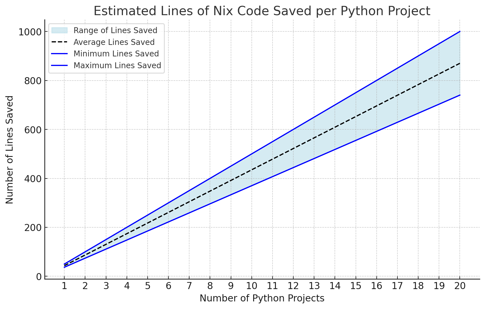

# DRYing Out Your Codebase with Reusable Library Functions

Welcome back! [Last time, we converted our Python projects into Nix
packages](https://blog.aicampground.com/p/nix-packaging-python-containers/) and built supporting
container images without needing to waste time recreating our environment in a `Dockerfile`. Now,
if we scale our codebase to include multiple Python projects, and we want to ensure they all follow
a consistent approach—such as exporting a Docker image, and running PyTests—we might consider using a
[Cookiecutter](https://www.cookiecutter.io/)
template and requiring everyone to use it when creating new projects. But what happens when circumstances
inevitably change, and we need to update something in that template? As mentioned in previous posts,
this would mean modifying a lot of files.

Fortunately, Nix is more than just a configuration language; it’s a fully functional programming
language. This allows us to write functions that can simplify these tasks. I could dive into concepts
like monads and purely functional programming, but I’ll spare you the detour. The approach you take to
writing and using utility functions for your organization is entirely up to you. In this post, I’ll share
some ideas and examples of how I’ve been using them to significantly simplify and standardize projects.

## Managing Complexity: Simplifying Verbose Nix Expressions

What’s the issue with the verbose nature of how we've done things? One advantage is that it offers full
control, and those familiar with Nix will understand what's happening. These are valid reasons to maintain
the verbosity in our Nix expressions when packaging Python programs. However, whether to streamline the
code is entirely up to you and your organization. If we remember that each `default.nix` is effectively
a single function, then it becomes relevant to consider how we manage complexity within those functions.

Martin Fowler, a well-respected figure in software development, offers an insightful principle regarding
function length:

> "If you have to spend effort figuring out what a fragment of code does, you
> should extract it into a function and name it after that 'what'." — [Martin
> Fowler](https://martinfowler.com/bliki/FunctionLength.html)

Applying this approach can certainly help junior developers and those unfamiliar with Nix quickly
grasp what’s happening, making them more effective. It also helps standardize our projects, ensuring
consistency and centralized control across all our work.

## Scaling Simplicity: Creating Reusable Functions for Standardized Nix Projects

After discussing the complexity of managing verbosity in Nix expressions, it’s clear that encapsulating
common patterns into reusable functions is a key strategy for maintaining simplicity and consistency
across projects. Let’s now look at how we can take the principles of reusability and DRY (Don't Repeat
Yourself) and apply them to standardize our Python projects.

For example:

[`./packages/projects/random_python_project/default.nix`](https://gitlab.com/initech-project/main-codebase/-/blob/main/packages/projects/random_python_project/default.nix?ref_type=heads#L50)

```nix
  random-python = pkgs.stdenv.mkDerivation {
    name = "random-python";
    src = ./.;
    phases = [ "installPhase" ];
    installPhase = ''
      mkdir -p $out/src
      mkdir -p $out/bin
      cp -r $src/* $out/src
      cp ${run-app}/bin/run-app $out/bin/random-python
      cp ${run-tests}/bin/run-tests $out/src/run-tests
    '';
    passthru = {
      python = python-env;
      test = run-tests;
      container = container;
    };
  };
```

[`./packages/projects/pc_load_letter/default.nix`](https://gitlab.com/initech-project/main-codebase/-/blob/c044a794cd342991dc0b6643dfedec4657ea199a/packages/projects/pc_load_letter/default.nix#L56)

```nix
  pc-load-letter = pkgs.stdenv.mkDerivation {
    name = "pc-load-letter";
    src = ./.;
    phases = [ "installPhase" ];
    installPhase = ''
      mkdir -p $out/src
      mkdir -p $out/bin
      mkdir -p $out/etc
      cp -r $src/* $out/src
      cp ${app_ini} $out/etc/api.ini
      cp ${run-with-wsgi}/bin/run-app $out/bin/run-app-with-wsgi
      cp ${run-tests}/bin/run-tests $out/src/run-tests
    '';
    passthru = {
      python = python-env;
      test = run-tests;
      container = container;
    };
    meta = {
      mainProgram = "run-app-with-wsgi";
    };
  };
```

The goal is to create a function that abstracts away details like `run-tests`, `container`, and possibly
`python-env`, as these are consistent across projects. Additionally, the function should return the
`mkDerivation` with the `passthru` section already included.

In Nix, function definitions look like this: `functionName = x: x * 2` for single arguments, or
`functionName = {arg1, arg2}: arg1 + arg2` for multiple arguments. Default arguments use this syntax:
`arg1 ? "defaultValue"`.

To demonstrate, here’s a hypothetical example where we create a function that adds a text file to
every derivation, as one might want to have happen in a Cookiecutter template.

First, we define the function and establish its arguments:

```nix
  example-text-file-function =
    {
      pkgs,
      name,
      installPhase,
      mainProgram,
    }:
```

Next, we create a `let ... in` block where we define the example text file. This is where we handle all
the work that the function needs to perform. We can create files with Nix functions such as `writeTextFile`
or we can import files from the file system.:

```nix
    let
      myTextFile = pkgs.writeTextFile {
        name = "example.txt";
        text = "This is some example text for the ${name} Project";
      };
      someFile = ./some-file.yaml
    in
```

Finally, we output a derivation that uniformly adds the example text files to all derivations:

```nix
    pkgs.stdenv.mkDerivation {
      name = "example";
      phases = [ "installPhase" ];
      installPhase =
        installPhase
        + ''
          mkdir -p $out/
          cp ${myTextFile} $out/example.txt
          cp ${someFile} $out/example.yaml
        '';
      meta = {
        inherit mainProgram;
      };
    };
```

If we now at our organization want to standardize our Python project in an opinionated way so that
they are uniform and our developer's who may be less familiar with Nix can more easily focus
on the actual tasks of writing Python and not Nix, we can write a function that looks like the following.

### Breaking Down the `mkPythonDerivation` Function

Now that we have a basic understanding of how we can write a function lets begin to write a more complex
function to simplify Python development at our organization. Let’s dive into what each part does:

1. **Function Header and Arguments:**

   ```nix
   mkPythonDerivation = {
     pkgs,
     name,
     src,
     phases ? [ "installPhase" ],
     pypkgs-build-requirements ? { },
     container ? { },
     buildPhase ? "",
     installPhase ? "",
     meta ? { },
   }:
   ```

   We define the function with several customizable arguments. The key parameters include:

   - `pkgs`: The package set, providing access to all the Nix packages.
   - `name`: The name of the derivation also used to give a name to the container this creates.
   - `src`: The source code directory where our `pyproject.toml` is located.
   - `phases`: By default, this includes only the `installPhase`, but it’s configurable.
   - `pypkgs-build-requirements`, `container`, `buildPhase`, `installPhase`, and `meta`: Optional
     configurations to fine-tune how the derivation behaves. The defaults for these were
     taken from what we had used in our previously in our Python packages and I think
     are reasonable enough to work for most cases.

2. **Handling Container Defaults:**

   ```nix
   let
     defaultContainer = {
       tag = "latest";
       contents = [ python-env ];
       config = {
         Entrypoint = [ "${python-env}/bin/python" ];
       };
     };
     finalContainer = defaultContainer // container;
   ```

   We define a `defaultContainer` configuration, which ensures every Python project has a consistent
   container setup. The final container is a merge of this default and any custom settings passed in
   via the `container` argument. _Note that the default container this creates returns a container with
   just the project's Python environment and will simply start a REPL._

3. **Overriding Poetry Dependencies:**

   ```nix
   p2n-overrides = pkgs.poetry2nix.defaultPoetryOverrides.extend (
     self: super:
     builtins.mapAttrs (
       package: build-requirements:
       let
         override = super.${package}.overridePythonAttrs (oldAttrs: {
           buildInputs =
             (oldAttrs.buildInputs or [ ]) ++ (builtins.map (req: super.${req}) build-requirements);
         });
       in
       override
     ) pypkgs-build-requirements
   );
   ```

   We use `poetry2nix` to manage Python dependencies, allowing for custom overrides. This block is
   [the part from our Python
   packages](https://blog.aicampground.com/p/nix-packaging-python-containers/#packaging) that handles
   [edgecases](https://github.com/nix-community/poetry2nix/blob/master/docs/edgecases.md).
   I am incorporating it into the function so that we can hope to abstract this part away as much as possible
   while still handling them. I understand the average developer who uses this might not fully understand
   all of Nix and so this helps to keep things simpler (or so I hope).

4. **Creating the Python Environment:**

   ```nix
   python-env = pkgs.poetry2nix.mkPoetryEnv {
     projectDir = src;
     python = pkgs.python311;
     overrides = p2n-overrides;
     preferWheels = true;
   };
   extended-python-env = python-env.withPackages (
     ps: with ps; [
       bpython
       pytest
       ipykernel
     ]
   );
   ```

   We define a `python-env` with dependencies using `poetry2nix`. To avoid including development tools
   like `pytest`, `bpython`, and `ipykernel` in our deployment builds, we create an `extended-python-env`
   specifically for development and testing. This environment includes these tools, ensuring they are
   available during development without affecting production builds.

5. **Utility Scripts for Common Tasks:**

   ```nix
   run-bpython = pkgs.writeShellScriptBin "run-bpython" ''
     export PYTHONPATH=${python-env}/lib/python${pythonVersion}/site-packages:${src}
     ${extended-python-env}/bin/bpython "$@"
   '';
   run-jupyter = pkgs.writeShellScriptBin "run-jupyter" ''
     export
     PYTHONPATH=${pkgs.jupyter-all}/lib/python${jupyterPythonVersion}/site-packages:${python-env}/lib/python${pythonVersion}/site-packages:${src}
     ${pkgs.jupyter-all}/bin/jupyter console "$@"
   '';
   run-tests = pkgs.writeShellScriptBin "run-tests" ''
     export PYTHONPATH="${python-env}/lib/python${pythonVersion}/site-packages:${src}"
     ${extended-python-env}/bin/pytest ${src}/tests/ "$@"
   '';
   ```

   We create scripts for running `bpython`, `jupyter`, and tests. These scripts standardize how developers
   interact with the environment, reducing friction and improving consistency across projects.

6. **Building the Container:**

   ```nix
   container = pkgs.dockerTools.buildLayeredImage {
     name = pyDerivation.name;
     inherit (finalContainer) tag contents config;
   };
   ```

   The container configuration is turned into a Docker image using `dockerTools.buildLayeredImage`,
   ensuring every project has a container aligned with our standardized setup.

7. **The Main Derivation:**

   ```nix
   pyDerivation = pkgs.stdenv.mkDerivation {
     name = name;
     src = src;
     phases = phases;
     buildPhase = buildPhase;
     installPhase =
       ''
         mkdir -p $out/src
         mkdir -p $out/bin
         cp -r $src/* $out/src
         cp ${run-tests}/bin/run-tests $out/src/run-tests
       ''
       + installPhase;
     passthru = {
       python = python-env;
       bpython = run-bpython;
       jupyter = run-jupyter;
       test = run-tests;
       container = container;
     };
     meta = meta;
   };
   ```

   The core of the function is the `mkDerivation`, which handles the actual build process. We include
   common setup steps, like copying source files and ensuring the test script is available. The `passthru`
   section makes all our utility scripts and container accessible in the final derivation.

8. **Returning the Derivation:**
   ```nix
   in
   pyDerivation;
   ```
   Finally, the derivation is returned, completing the function. The complete code for this
   function can be found
   [here](https://gitlab.com/initech-project/main-codebase/-/blob/main/lib/python/default.nix?ref_type=heads)

### Using `mkPythonDerivation` in our Codebase

If we take a look at the [`pc-load-letter`
project](https://gitlab.com/initech-project/main-codebase/-/blob/main/packages/projects/pc_load_letter/default.nix?ref_type=heads),
you’ll notice the configuration is much cleaner now, even though this is the more complex of the two
example Python projects since it needs to run using uWSGI. Let’s focus on what has changed in the
`default.nix` file:

```nix
  pc-load-letter = mkPythonDerivation {
    inherit pkgs name src;
    installPhase = ''
      mkdir -p $out/etc
      cp ${app_ini} $out/etc/api.ini
      cp ${run-with-wsgi}/bin/run-app $out/bin/run-app-with-wsgi
    '';
    container = {
      inherit name;
      tag = "latest";
      contents = [ run-with-wsgi ];
      config = {
        Entrypoint = [ "run-app" ];
      };
    };
    meta = {
      mainProgram = "run-app-with-wsgi";
    };
```

Notice how adding `app_ini` and `run-with-wsgi` to the `installPhase` is nearly all that’s needed. The
`installPhase` is where you define the steps to prepare your package for deployment. In this case, it
simply copies the necessary configuration files and scripts to their correct locations within the container.

The container section only needs to define the `Entrypoint` and
`contents`, pointing to the `run-with-wsgi` script we created in our [previous
post](https://blog.aicampground.com/p/nix-packaging-python-containers). The `Entrypoint` is what the
container will execute when it starts, and `contents` lists all dependencies or files that need to be
present in the container.

Here’s where the declarative nature of Nix really shines. By writing down everything your project
requires in a straightforward way, like listing out dependencies and scripts, Nix automatically handles
the rest. The process is declarative because you’re simply describing what you need (e.g., files,
scripts, dependencies) without worrying about how they get added. Nix ensures the environment is set up
with exactly what you’ve declared and nothing more.

Lastly, the `run-app-with-wsgi` script is named differently from the main project’s name. To handle this,
we specify it in `meta.mainProgram`, which tells Nix what to run when executing the container. While
renaming the script to match the project’s name could’ve worked, I kept the original name to show
how to handle cases where the script name doesn’t match the project name.

This `mkPythonDerivation` function abstracts away much of the complexity, allowing developers to focus
on writing Python code while providing a consistent and standardized build environment. By adopting this
approach, I compared the lines of code before and after using the function and found that it reduces our
codebase by 37 to 50 lines per Python package. Additionally, it ensures that our Python packages adhere
to a consistent delivery standard.

<div style="text-align: center;">
  
</div>

This is a prime example of how Nix’s functional programming capabilities can significantly DRY up a
codebase while still offering flexibility and control. This approach isn't limited to just Python projects;
it can be applied to any type of software. For instance, I created a similar function for the Flink jobs
in [our
repository](https://gitlab.com/initech-project/main-codebase/-/blob/385fe2c96259818cf30d9b563f10972fc5bdd919/lib/flink/default.nix).
Although that function ended up being a bit lengthy—over 100 lines—due to the
complexity it abstracts, developers now only need to write 4 lines of Nix code to develop and package
a Flink job. By encapsulating common patterns into reusable functions, we achieve both simplicity and
standardization across the project, all while leveraging Nix’s powerful and declarative framework.

This example illustrates how reusable functions in Nix can simplify a wide range of scenarios, not just
Python packaging. Whether it’s Python, Flink, or any other software component, the principles remain
the same: by centralizing common patterns into concise functions, we can reduce redundancy, improve
maintainability, and ensure consistency across an entire codebase.

## Wrapping it up

To wrap things up, embracing reusable functions in Nix allows you to significantly DRY out your codebase
while keeping everything standardized and easy to manage. Not only do these functions reduce the lines
of code across projects, but they also abstract away complexity, making the onboarding process easier
for new developers and ensuring that changes to your infrastructure are painless and scalable.

The true strength of Nix lies in its flexibility combined with its declarative approach. By leveraging
Nix’s functional programming features, you can tailor your development environment precisely to your
needs, enforcing best practices across the board. While this post focused on Python projects, the same
principles can be applied to various other types of software within your organization, allowing you to
standardize without losing the control and customization that Nix offers.

I encourage you to explore further, experiment with writing your own reusable functions, and discover
how they can simplify your workflow while enhancing consistency and reproducibility across your projects.
To see exactly how these concepts were applied in practice, you can review the code changes introduced
in this blog post by checking out the merge request linked below.

[](https://gitlab.com/initech-project/main-codebase/-/merge_requests/4)
