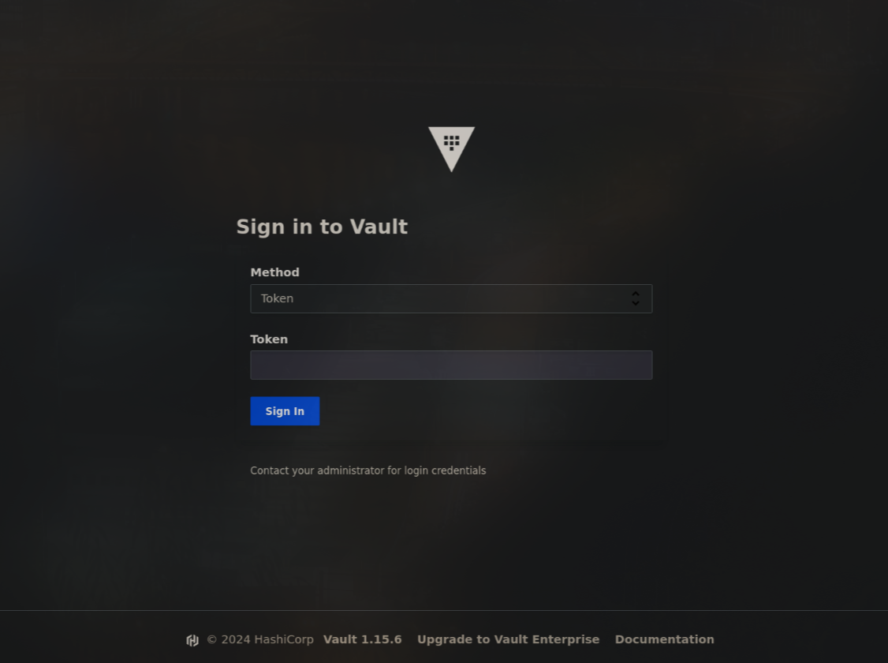

+++
author = "Matt Camp"
title = "How to stand-up Vault with NixOS"
date = "2024-12-07"
image = "vault-login.png"
description = "Learn how to set up Vault on a NixOS system from scratch using my dotfiles. This step-by-step guide covers everything from deploying a new system configuration to securely managing secrets with Vault's CLI and UI, making it easier to integrate Vault into your infrastructure."
tags = [
    "Nix",
    "Vault"
]
categories = [
    "Nix",
    "DevOps",
    "Tutorial"
]
+++

# How to stand-up Vault in a New Environment

This tutorial is how to create a new system and install Vault on it so that
we can get other systems to work. This will assume that all that has been
installed is a blank NixOS system, real or virtual. This also assumes
you are using [this repo](https://gitlab.com/usmcamp0811/dotfiles.git) or at least a fork or some derivation of this repo.

## Step 1. Deploy Barebones Archetype

If this is a new system that doesn't already exist in these dotfiles then
we need to create it in `./systems/x86_64-linux/<system hostname>` or
if its not `x86_64-linux` use the correct architecture name. I have a
template for this scenario. After creating the directory just `cd`
into it and run:

```sh
nix flake init --template gitlab:usmcamp0811/dotfiles#new-system
# or if its an Azure VM or some other Virtual Machine maybe try
nix flake init --template gitlab:usmcamp0811/dotfiles#new-azure-vm
```

> Note: You can probably add `campground.services.vault` to the system
> config now otherwise after you deploy add it and deploy again.

To deploy the system we can use `deploy-rs` to get the system config to
the new machine. This is super useful if your system is slow such as when
its a 2 threaded VM. I have a Nix shell I have created that should have
all the things you need already pre-loaded into it. The rest of this
tutorial will assume you are in it. To activate this shell just run the
following command:

```sh
nix develop gitlab:usmcamp0811/dotfiles#deploy-shell
```

**Deploying Barebones config (+ Vault):**

```
deploy --hostname <ip|hostname> --skip-checks /location/of/flake#<new system hostname>
```

> NOTE: If you have problems with the deploy command you may want to try running
> it with `--ssh-user <your user on the remote machine>`. This is because my
> flake defaults to `root` and as seen [here](https://gitlab.com/usmcamp0811/dotfiles/-/blob/nixos/lib/deploy/default.nix?ref_type=heads#L46)

## Step 2. Initialize & Unseal Vault

Excellent! You now have a new system running. Now lets get Vault setup. I am
assuming you deployed Vault to the system above. The following can be run
in the `deploy-shell` anywhere that can reach the newly deployed Vault.

```sh
# to see options pass
# init-vault --help
init-vault
```

> NOTE: If you are running this anywhere other than on the system that has Vault
> running on it you **MUST** set `VAULT_ADDR` with the correct location of Vault.

This script will initialize Vault with a single root token and a single unseal key, which are necessary
for managing and accessing the Vault. The unseal key is required to "unlock" the Vault after it starts,
enabling it to decrypt and serve stored secrets, while the root token provides full administrative
access. The `init-vault` script will securely save these credentials to predefined or user-specified
file paths, ensuring they are available for future use. Once initialized, the script will automatically
unseal the Vault, making it ready to store and retrieve secrets. This simplifies the process of setting
up Vault in a new environment and ensures it is properly configured for secure operations. You are
free to re-key the Vault at anytime if your security posture changes and desire more than a single
root token.

## Step 3. Accessing Vault UI and Configuring Vault

Now that Vault has been initialized we probably want to be able to access our Vault from
the WebUI. By default in my config it can be reached from `http://0.0.0.0:8200` but if you
passed different options to the module when enabling it in your new system, you should use
that `hostname` or `ip`. In other tutorials I will cover how to setup Traefik so we
can use more human readable addresses.

### Vault UI

**In a web browser** navigate to [http://new-server-ip:8200](http://new-server-ip:8200). If
everything went well you should be presented with the Vault Login page that looks something
like this:



Use your root token, found by default at `/var/lib/vault/root-token`, to login.
Once in you can create your KV stores how ever you would like. I have mine setup
with a KV version 2 store at `secret/campground`. You don't need the UI to do this
it can be done with the following shell command, done somewhere that has `VAULT_ADDR`
set correctly and is logged into Vault.

### Adding Secrets with the CLI

```sh
# in nix develop gitlab:usmcamp0811/dotfiles#deploy-shell

export VAULT_ADDR=http://my-new-hostname:8200
vault login

# provide root token
vault secrets enable -path=secret/mydomain -version=2 kv

# confirm its creation
vault secrets list

# add secrets
vault kv put secret/mydomain/mysecret key1=value1 key2=value2
```

> **⚠️ WARNING:** Secrets entered via the Vault CLI may be saved in your shell history.
> To protect sensitive data, consider using environment variables or other secure methods
> to input secrets.

### Adding Policies

Adding policies to your running Vault is effortless if you use the `policy-agent` option
and you place all your policies into a folder in the system config directory. Doing this
will run a simple script to add all the policies whenever you update the config. I suggest
the following settings when enabling `vault`:

```nix
campground.services.vault = {
  enable = true;
  ui = true;
  storage = {
    backend = "file";
    path = "/persist/vault";
  };
  # This is the secret sauce to get all `*.hcl` files in the `./vault/policies` folder
  # The path is relative to the system's `default.nix`.
  policies = builtins.foldl' (policies: file:
    policies // {
      "${snowfall.path.get-file-name-without-extension file}" = file;
    }) { } (builtins.filter (snowfall.path.has-file-extension "hcl")
      (builtins.map (path:
        ./vault/policies + "/${
          builtins.baseNameOf (builtins.unsafeDiscardStringContext path)
        }") (snowfall.fs.get-files ./vault/policies)));
};
```

The `admin.hcl` files should look something like the following:

```hcl
path "*" {
	capabilities = [ "create", "list", "read", "update", "delete", "patch", "sudo" ]
}
```

> NOTE: The filename becomes the policy name.

You can still add policies through the UI or CLI but depending how you set `campground.services.vault.mutable-policies`
these may be overwritten whenever you redeploy the system. I recommend disabling the `mutable-policies` and simply relying
on the `policy-agent` to manage your policies because this means you can version your policies along side your system config.

## Step 4. Creating Approles

At this point we should have Vault running, secrets created and policies define for those secrets.
Now we need to create some approles so that we can have unattended processes/systems
get secrets from our Vault in a secure manner. Hashi Corps has good [documentation](https://developer.hashicorp.com/vault/docs/auth/approle)
explaining how to create approles, but I have some helper scripts I use to do pretty simply.
I suggest naming your approles the same as your system, but how you name your approles is
up to you.

```sh
# in nix develop gitlab:usmcamp0811/dotfiles#deploy-shell

create-approle my-new-system my-policy
```

## Step 5. Configure NixOS to use an Approle

We now have create an approle for our new system and assigned it a policy appropriate for the role
the server is going to serve. We just need to save the secrets somewhere on the new system
and tell our NixOS system config about them. The follow must be done on the server assigned
the new approle.

```sh
# in nix develop gitlab:usmcamp0811/dotfiles#deploy-shell

save-approle-secrets my-new-system
```

Now that we have our approle saved to our system we can begin to enable the `campground.services.vault-agent` service
on any and all of our systems. The `vault-agent` service is a simple service that patches SystemD services
with secrets retrieved from Vault. This allows us to enable things on our system that might require passwords
or sensitive files without hard coding them in our git repo or have them get saved in our world readable Nix store.

```nix
# in your new system config

campground.services.vault-agent = {
  enable = true;
  settings = {
    vault = {
      address = "http://my-vault-ip-or-hostname:8200";
      role-id = "/var/lib/vault/<my-approle-name>/role-id";
      secret-id = "/var/lib/vault/<my-approle-name/secret-id";
    };
  };
};
```

> **⚠️ WARNING:** Make sure you put the correct `address`, `role-id` and `secret-id`! If you don't
> it's not entirely obvious it could take a long time trying to authenticate before
> finally failing

## Migrating from `file` backend to `raft`

If you have deployed your Vault with a `file` storage backend and you decided that you want to use a `raft` backend
all is not lost! The migration is pretty simple. You just need to make a `hcl` file that looks like this:

> **⚠️ WARNING:** Make sure you backup your Vault to avoid losing secrets

```hcl
# migrate.hcl
storage_source "file" {
  path = "/persist/vault/"
}

storage_destination "raft" {
  path = "/persist/vault-raft/"
  node_id = "vault-node-0"
}

cluster_addr = "http://127.0.0.1:8200"

```

Then just make sure to redeploy your NixOS config with the Vault having `raft` enabled as the backend storage.
When the system finishes switching, stop Vault with `systemctl stop vault`. Finally you can run:

```sh
vault operator migrate --config migrate.hcl
```

When this finishes start the Vault `systemctl start vault` then you should be able to `unseal` the Vault
with your previous key(s) and login.

> NOTE: As I was figuring this out I had to blow away the `/persist/vault-raft` directory a couple times and
> when I recreated it there were some permissions issues that had to be addressed so Vault could write a log
> file. With any luck you wont have this problem but if you do just check `journactl` it should give good
> enough clues that can get you going.
