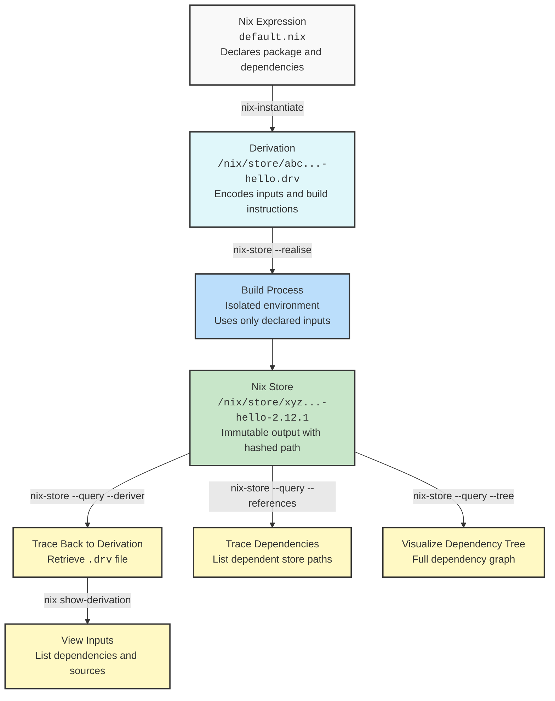

:: title ::

# Built-in Traceability

:: left ::

:: right ::

- **Start with a Nix expression** — declares everything needed to build
- **Instantiated into a derivation (`.drv`)** — captures the full build recipe
- **Build runs in a pure sandbox** — only declared inputs are allowed
- **Produces a hashed output in `/nix/store`** — content-addressed and immutable
- **Reverse traceable** — map output back to its `.drv` and declared inputs
- **Inspect the full dependency graph** — see all runtime and build-time dependencies
- **Transparent by default** — every artifact has a clear and auditable history

<Admonition title="Strategic Advantage" color="amber-light">
Every step — from source to binary — is reproducible, inspectable, and secure by default.
</Admonition>
