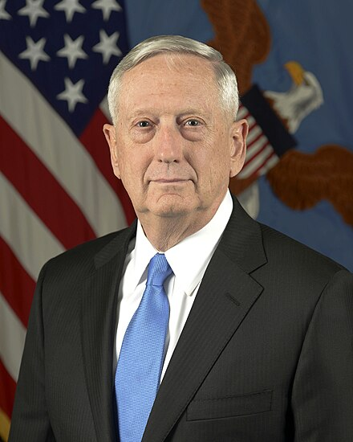

# Jim Mattis

## Personal Information

**Full Name:** James Norman Mattis  
**Born:** September 8, 1950 (age 74) – Pullman, Washington, U.S.  
**Nickname(s):** "Mad Dog," "Warrior Monk," "Chaos"  
**Political Party:** Independent  
**Education:**

- **Central Washington University** _(BA)_
- **National War College**

---

## Military Service

**Allegiance:** United States  
**Branch:** United States Marine Corps  
**Years of Service:** 1969–2013  
**Rank:** **General**  
**Commands Held:**

- **United States Central Command (CENTCOM)**
- **United States Joint Forces Command (JFCOM)**
- **Supreme Allied Commander Transformation (NATO)**
- **I Marine Expeditionary Force**
- **1st Marine Division**
- **7th Marine Regiment**
- **1st Battalion, 7th Marines**

### Battles & Wars

- **Persian Gulf War**
- **War in Afghanistan**
- **Iraq War** _(Invasion of Iraq, Battle of Fallujah)_

### Awards & Decorations

- **Defense Distinguished Service Medal (2×)**
- **Navy Distinguished Service Medal (2×)**
- **Defense Superior Service Medal**
- **Legion of Merit (2×)**
- **Bronze Star Medal with Combat "V"**
- **Meritorious Service Medal (3×)**
- **Navy & Marine Corps Commendation Medal (2×)**

---

## 26th United States Secretary of Defense

- **Term:** January 20, 2017 – January 1, 2019
- **President:** Donald Trump
- **Deputy:** Patrick M. Shanahan
- **Preceded by:** Ashton Carter
- **Succeeded by:** Patrick M. Shanahan (acting)

As Secretary of Defense, **Mattis prioritized military readiness, alliances, and strategic deterrence**.
He resigned in December 2018 over **policy disagreements with President Trump** regarding troop withdrawals
from Syria and Afghanistan.

---

## Other Roles & Achievements

- **Author of "Call Sign Chaos: Learning to Lead" (2019)**
- **Fellow at the Hoover Institution at Stanford University**
- **Member of General Dynamics’ Board of Directors** _(2013–2017, rejoined in 2019)_
- **Strong advocate for military professionalism and strategic deterrence**
- **Known for his extensive personal library and deep study of military history**

---

## Notable Quotes

- **"Be polite, be professional, but have a plan to kill everybody you meet."**
- **"The most important six inches on the battlefield is between your ears."**
- **"PowerPoint makes us stupid."**

---

Jim Mattis is widely regarded as one of the most influential Marine generals of his generation, known
for his **tactical brilliance, leadership philosophy, and dedication to U.S. military strategy**.
